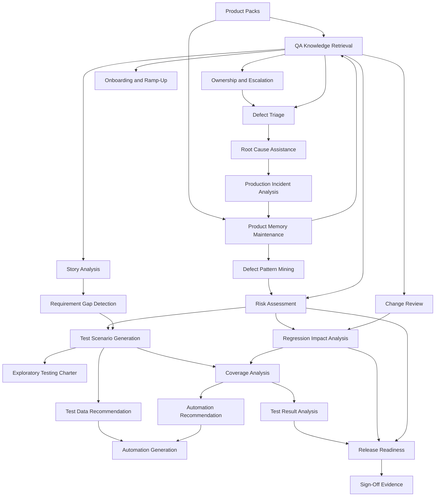

# PMQA QA Workflow Loops

PMQA is a Product Memory QA Agent. Its strongest role is not to replace QA work, but to create reusable loops that help QA engineers preserve, retrieve, reason over, and apply product knowledge during testing.

This architecture catalog identifies QA workflow loops PMQA could support and
their dependencies. It is not an implementation-status document or a roadmap;
see [the project roadmap](../Roadmap.md) for committed phase status.

## Loop Inventory

### 1. QA Knowledge Retrieval Loop

**Goal:** Retrieve relevant product knowledge at the moment a QA engineer needs context.

**Inputs:**

- User question
- Feature name, workflow, ticket, bug, release, or product area
- Product pack memory
- Historical defects
- Business rules and testing notes

**Processing Steps:**

1. Interpret the user's QA intent.
2. Identify relevant product area, feature, workflow, or entity.
3. Retrieve matching memory from product packs.
4. Rank information by relevance, recency, risk, and confidence.
5. Summarize the answer with source references where available.
6. Suggest follow-up questions or adjacent risk areas.

**Outputs:**

- Context summary
- Relevant business rules
- Historical defects
- Testing guidance
- Ownership notes
- Confidence and gaps

**Required Knowledge:**

- Product memory
- Feature taxonomy
- Business rules
- Historical defects
- Ownership map
- QA terminology

**Required Integrations:**

- Product memory store
- Documentation system
- Issue tracker
- Test management tool, optional
- Source references, optional

**Complexity:** Medium
**Business Value:** High
**AI Feasibility Today:** High

### 2. Product Memory Maintenance Loop

**Goal:** Keep product memory accurate, current, structured, and useful.

**Inputs:**

- New tickets
- Closed bugs
- Release notes
- QA notes
- Product documentation
- User corrections
- Incident reports

**Processing Steps:**

1. Detect new or changed product knowledge.
2. Extract candidate facts, rules, risks, owners, and defect learnings.
3. Classify content by feature, workflow, rule, risk, or bug pattern.
4. Identify duplicates, conflicts, stale knowledge, and missing metadata.
5. Ask for human confirmation when confidence is low.
6. Update the relevant product pack.
7. Preserve source links and update history.

**Outputs:**

- Updated product-pack memory
- New or revised knowledge entries
- Staleness warnings
- Conflict reports
- Suggested memory curation tasks

**Required Knowledge:**

- Product-pack schema
- Product taxonomy
- Business rule formats
- Defect metadata
- Source reliability rules

**Required Integrations:**

- Issue tracker
- Documentation system
- Release notes
- Chat or QA note sources, optional
- Versioned memory store

**Complexity:** High
**Business Value:** High
**AI Feasibility Today:** Medium

### 3. Story Analysis Loop

**Goal:** Analyze a user story or requirement and surface QA-relevant context before testing begins.

**Inputs:**

- User story
- Acceptance criteria
- Design notes
- Product area
- Linked tickets or epics
- Product memory

**Processing Steps:**

1. Parse the story intent, changed behavior, users, states, and workflows.
2. Retrieve relevant business rules, historical bugs, and prior testing guidance.
3. Identify impacted features and integrations.
4. Detect ambiguous requirements or missing acceptance criteria.
5. Generate QA questions for product, engineering, or design.
6. Summarize likely risk areas.

**Outputs:**

- Story QA summary
- Ambiguity list
- Requirement questions
- Relevant product memory
- Initial risk notes
- Suggested testing focus

**Required Knowledge:**

- Product memory
- Business rules
- Feature ownership
- Historical bugs
- Requirement quality heuristics

**Required Integrations:**

- Issue tracker
- Documentation system
- Product pack
- Design tool, optional

**Complexity:** Medium
**Business Value:** High
**AI Feasibility Today:** High

### 4. Requirement Gap Detection Loop

**Goal:** Identify missing, ambiguous, inconsistent, or untestable requirements.

**Inputs:**

- Requirements
- Acceptance criteria
- Product memory
- Business rules
- Historical requirement-related bugs
- Existing test cases

**Processing Steps:**

1. Compare requirements against known product rules.
2. Check for missing states, roles, permissions, edge cases, and failure modes.
3. Identify contradictions with historical behavior or documentation.
4. Detect untestable language and vague acceptance criteria.
5. Map gaps to possible risk and user impact.
6. Produce clarification questions.

**Outputs:**

- Requirement gaps
- Ambiguities
- Contradictions
- Clarifying questions
- Risk rationale

**Required Knowledge:**

- Business rules
- Product behavior history
- Domain vocabulary
- Requirement quality patterns
- Historical defect causes

**Required Integrations:**

- Issue tracker
- Documentation system
- Product memory store
- Test management tool, optional

**Complexity:** Medium
**Business Value:** High
**AI Feasibility Today:** High

### 5. Risk Assessment Loop

**Goal:** Estimate quality risk for a story, feature, workflow, release, or product area.

**Inputs:**

- Story, feature, release, or change description
- Historical defects
- Business criticality
- Change scope
- Ownership changes
- Test coverage signals
- Incident history

**Processing Steps:**

1. Identify the impacted product area.
2. Retrieve historical bugs, incidents, fragile workflows, and business rules.
3. Evaluate user impact, revenue impact, compliance impact, complexity, and change size.
4. Detect repeated defect patterns.
5. Score or classify risk.
6. Explain the rationale and recommended QA focus.

**Outputs:**

- Risk rating
- Risk factors
- Historical evidence
- Recommended test focus
- Suggested escalation or review areas

**Required Knowledge:**

- Historical bugs
- Incident history
- Business criticality
- Product workflows
- Risk taxonomy
- Ownership and dependency map

**Required Integrations:**

- Product pack
- Issue tracker
- Incident management system
- Observability system, optional
- Test management tool, optional

**Complexity:** Medium
**Business Value:** High
**AI Feasibility Today:** High

### 6. Test Scenario Generation Loop

**Goal:** Generate targeted test scenarios grounded in product memory and risk.

**Inputs:**

- Story or feature
- Acceptance criteria
- Risk assessment
- Business rules
- Historical bugs
- Existing test cases

**Processing Steps:**

1. Identify core workflows and user roles.
2. Retrieve relevant memory and prior defects.
3. Generate happy path, negative, edge, permission, integration, and regression scenarios.
4. Prioritize scenarios based on risk and historical failure patterns.
5. Mark assumptions and dependencies.
6. Avoid duplicating existing tests where coverage is known.

**Outputs:**

- Prioritized test scenarios
- Regression scenarios
- Edge cases
- Negative cases
- Traceability to risks, rules, and bugs

**Required Knowledge:**

- Product rules
- User workflows
- Historical defects
- Risk assessment output
- Existing test inventory
- QA test design heuristics

**Required Integrations:**

- Product pack
- Issue tracker
- Test management system
- Documentation system

**Complexity:** Medium
**Business Value:** High
**AI Feasibility Today:** High

### 7. Regression Impact Analysis Loop

**Goal:** Identify what should be regression tested based on current changes and product history.

**Inputs:**

- Change description
- Pull request or commit summary
- Story or release scope
- Product memory
- Historical defects
- Dependency map
- Existing test inventory

**Processing Steps:**

1. Identify changed product areas and dependencies.
2. Map changes to workflows, business rules, and owners.
3. Retrieve related historical defects and fragile areas.
4. Compare against existing regression coverage.
5. Recommend focused regression areas.
6. Explain what can be deprioritized and why.

**Outputs:**

- Regression impact summary
- Prioritized regression checklist
- Related historical bugs
- Coverage gaps
- Recommended test owners or reviewers

**Required Knowledge:**

- Product dependency map
- Feature ownership
- Historical bug memory
- Business rules
- Existing regression suites
- Code-to-feature mapping, optional

**Required Integrations:**

- Issue tracker
- Source control
- CI system, optional
- Test management system
- Product pack

**Complexity:** High
**Business Value:** High
**AI Feasibility Today:** Medium

### 8. Coverage Analysis Loop

**Goal:** Compare known risks, requirements, and product rules against existing test coverage.

**Inputs:**

- Requirements
- Product memory
- Risk assessment
- Existing manual test cases
- Automated tests
- Historical defects

**Processing Steps:**

1. Build a coverage model by feature, workflow, risk, and rule.
2. Map existing tests to the model.
3. Identify uncovered business rules, risks, and bug patterns.
4. Distinguish important gaps from low-value gaps.
5. Recommend coverage improvements.

**Outputs:**

- Coverage map
- Gap list
- Duplicative coverage notes
- High-value additions
- Traceability report

**Required Knowledge:**

- Test inventory
- Business rules
- Product memory
- Risk taxonomy
- Historical bugs
- Requirement-to-test mapping

**Required Integrations:**

- Test management system
- Automation repositories
- Product pack
- Issue tracker
- CI system, optional

**Complexity:** High
**Business Value:** High
**AI Feasibility Today:** Medium

### 9. Automation Recommendation Loop

**Goal:** Recommend which scenarios are worth automating and why.

**Inputs:**

- Test scenarios
- Regression impact analysis
- Historical bug frequency
- Execution frequency
- Stability signals
- Manual testing cost
- Automation inventory

**Processing Steps:**

1. Identify repeatable, high-value scenarios.
2. Evaluate risk, frequency, stability, data needs, and maintenance cost.
3. Exclude scenarios that are poor automation candidates.
4. Compare against existing automation.
5. Recommend automation priority and layer: unit, API, integration, UI, contract, or monitoring.
6. Provide rationale and expected value.

**Outputs:**

- Automation candidate list
- Priority ranking
- Recommended automation layer
- Non-candidates and rationale
- Coverage links

**Required Knowledge:**

- Test scenarios
- Historical defects
- Automation strategy
- Product architecture
- Existing automation inventory
- CI constraints

**Required Integrations:**

- Test management system
- Automation repositories
- CI system
- Product pack
- Source control, optional

**Complexity:** Medium
**Business Value:** High
**AI Feasibility Today:** High

### 10. Automation Generation Loop

**Goal:** Generate or update executable automated tests based on approved scenarios.

**Inputs:**

- Approved automation candidate
- Existing automation framework
- Test data requirements
- Page objects or API clients
- Product behavior rules
- Environment configuration

**Processing Steps:**

1. Inspect existing test framework and patterns.
2. Convert scenario into executable test steps.
3. Reuse existing helpers, fixtures, and page objects.
4. Generate code changes.
5. Run tests locally or in CI.
6. Analyze failures and iterate.
7. Produce review-ready changes.

**Outputs:**

- Automated test code
- Updated fixtures or test data
- Execution results
- Pull request summary

**Required Knowledge:**

- Automation framework
- Product behavior
- Test data model
- Existing code patterns
- Environment setup

**Required Integrations:**

- Source control
- CI system
- Test framework
- Secrets or environment manager
- Product pack

**Complexity:** High
**Business Value:** Medium
**AI Feasibility Today:** Medium

### 11. Defect Triage Loop

**Goal:** Help classify, prioritize, route, and enrich incoming defects.

**Inputs:**

- Bug report
- Reproduction steps
- Logs, screenshots, videos, or traces
- Product memory
- Historical defects
- Ownership map
- Release context

**Processing Steps:**

1. Summarize the defect.
2. Identify affected feature, workflow, user role, and environment.
3. Search for duplicates or similar historical bugs.
4. Estimate severity, priority, and risk.
5. Suggest owner, component, labels, and missing information.
6. Recommend next diagnostic steps.

**Outputs:**

- Triage summary
- Suggested severity and priority
- Possible duplicates
- Owner or component recommendation
- Missing details checklist
- Related memory links

**Required Knowledge:**

- Historical bugs
- Feature ownership
- Severity and priority rules
- Product behavior
- Release scope

**Required Integrations:**

- Issue tracker
- Product pack
- Observability or log system, optional
- Customer support system, optional

**Complexity:** Medium
**Business Value:** High
**AI Feasibility Today:** High

### 12. Root Cause Assistance Loop

**Goal:** Assist QA and engineering in narrowing likely causes of a defect.

**Inputs:**

- Bug report
- Reproduction steps
- Logs or traces
- Recent code changes
- Historical similar defects
- Environment details
- Product architecture notes

**Processing Steps:**

1. Normalize defect symptoms and affected flow.
2. Retrieve similar historical bugs and their fixes.
3. Correlate symptoms with recent changes or dependencies.
4. Identify likely failure layers: data, UI, API, integration, permissions, config, third party, or deployment.
5. Suggest targeted reproduction or diagnostic steps.
6. Produce a hypothesis list with confidence.

**Outputs:**

- Likely root cause hypotheses
- Similar historical defects
- Diagnostic plan
- Suspect components
- Questions for engineering

**Required Knowledge:**

- Product architecture
- Historical bug fixes
- Ownership map
- Logs and observability conventions
- Release and deployment history

**Required Integrations:**

- Issue tracker
- Source control
- Observability system
- CI/CD system
- Product pack

**Complexity:** High
**Business Value:** Medium
**AI Feasibility Today:** Medium

### 13. Test Data Recommendation Loop

**Goal:** Recommend suitable test data and data conditions for testing a feature or scenario.

**Inputs:**

- Scenario or workflow
- Business rules
- User roles
- Data constraints
- Historical bugs
- Environment capabilities

**Processing Steps:**

1. Identify required entities, states, roles, permissions, and boundary values.
2. Retrieve known useful test data patterns.
3. Identify risky data combinations from historical bugs.
4. Recommend reusable fixtures or setup steps.
5. Warn about unstable, sensitive, or unavailable data.

**Outputs:**

- Test data recommendations
- Boundary and edge data cases
- Fixture suggestions
- Data setup notes
- Data risks

**Required Knowledge:**

- Data model
- Business rules
- Environment constraints
- Existing fixtures
- Historical data-related bugs

**Required Integrations:**

- Test data management system
- Database or API docs, optional
- Product pack
- Automation repository, optional

**Complexity:** Medium
**Business Value:** Medium
**AI Feasibility Today:** Medium

### 14. Release Readiness Loop

**Goal:** Summarize whether a release is ready from a QA risk perspective.

**Inputs:**

- Release scope
- Open defects
- Test execution status
- Risk assessments
- Regression impact analysis
- Coverage gaps
- Incidents or recent failures
- Sign-off criteria

**Processing Steps:**

1. Aggregate release scope and quality signals.
2. Identify high-risk features and unresolved defects.
3. Compare planned testing against actual execution.
4. Highlight gaps, blockers, and residual risks.
5. Summarize readiness by product area.
6. Produce sign-off recommendation or escalation notes.

**Outputs:**

- Release readiness summary
- Risk register
- Blockers
- Test completion summary
- Go/no-go recommendation support
- Stakeholder-ready report

**Required Knowledge:**

- Release scope
- Defect severity rules
- Test status
- Risk assessments
- Product criticality
- Sign-off policy

**Required Integrations:**

- Issue tracker
- Test management system
- CI system
- Release management tool
- Product pack

**Complexity:** High
**Business Value:** High
**AI Feasibility Today:** Medium

### 15. Production Incident Analysis Loop

**Goal:** Convert production incidents into durable QA learning and future test strategy.

**Inputs:**

- Incident report
- Timeline
- Customer impact
- Root cause notes
- Related bugs
- Monitoring data
- Release context

**Processing Steps:**

1. Summarize incident symptoms, impact, and timeline.
2. Map incident to product area, workflow, business rule, and owner.
3. Identify missed testing opportunities.
4. Extract regression scenarios and risk signals.
5. Update product memory with incident learnings.
6. Recommend coverage, monitoring, or process improvements.

**Outputs:**

- Incident QA summary
- Missed test analysis
- New risk signals
- Regression recommendations
- Product memory updates

**Required Knowledge:**

- Incident history
- Product workflows
- Business criticality
- Historical defects
- Root cause taxonomy
- Existing coverage

**Required Integrations:**

- Incident management system
- Observability system
- Issue tracker
- Product pack
- Test management system

**Complexity:** High
**Business Value:** High
**AI Feasibility Today:** Medium

### 16. Test Result Analysis Loop

**Goal:** Analyze manual or automated test results to identify patterns, failures, risk, and next actions.

**Inputs:**

- Test execution results
- Failed test logs
- Screenshots or traces
- Recent changes
- Known flaky tests
- Product memory

**Processing Steps:**

1. Summarize pass, fail, blocked, skipped, and flaky signals.
2. Cluster failures by component, symptom, or likely cause.
3. Compare failures against known issues and historical bugs.
4. Distinguish product failures from environment or test issues.
5. Recommend retests, defect creation, or escalation.

**Outputs:**

- Test result summary
- Failure clusters
- Suspected causes
- Known issue matches
- Recommended next actions

**Required Knowledge:**

- Test inventory
- Known flaky tests
- Product memory
- Historical defects
- Environment behavior

**Required Integrations:**

- Test management system
- CI system
- Automation reports
- Issue tracker
- Observability system, optional

**Complexity:** Medium
**Business Value:** High
**AI Feasibility Today:** High

### 17. Defect Pattern Mining Loop

**Goal:** Detect recurring defect patterns that should influence future QA strategy.

**Inputs:**

- Historical defects
- Incident records
- Root cause categories
- Feature taxonomy
- Release history
- Ownership changes

**Processing Steps:**

1. Normalize historical bugs by feature, symptom, cause, severity, and date.
2. Cluster similar bugs and repeated failure modes.
3. Identify high-risk components, workflows, and rule families.
4. Detect trend changes across releases or teams.
5. Convert patterns into reusable risk signals.

**Outputs:**

- Defect pattern report
- Product risk hotspots
- Repeated root causes
- Testing strategy recommendations
- Product memory updates

**Required Knowledge:**

- Historical bug corpus
- Feature taxonomy
- Root cause taxonomy
- Release timeline
- Ownership map

**Required Integrations:**

- Issue tracker
- Incident management system
- Product memory store
- Analytics store, optional

**Complexity:** High
**Business Value:** High
**AI Feasibility Today:** Medium

### 18. Exploratory Testing Charter Loop

**Goal:** Create focused exploratory testing charters using product memory and risk signals.

**Inputs:**

- Feature or release area
- Risk assessment
- Historical bugs
- Business rules
- Known gaps
- Tester constraints

**Processing Steps:**

1. Identify exploratory mission and target workflows.
2. Retrieve relevant risk signals and past failures.
3. Define charters with scope, heuristics, data needs, and timebox.
4. Include observation prompts and bug-hunting angles.
5. Capture session notes back into memory.

**Outputs:**

- Exploratory test charters
- Session prompts
- Data and environment notes
- Follow-up memory updates

**Required Knowledge:**

- Exploratory testing heuristics
- Product workflows
- Historical bugs
- Business rules
- Risk assessment

**Required Integrations:**

- Product pack
- Test management or notes tool
- Issue tracker, optional

**Complexity:** Medium
**Business Value:** High
**AI Feasibility Today:** High

### 19. Ownership and Escalation Loop

**Goal:** Route QA questions, defects, and risks to the right owners quickly.

**Inputs:**

- Feature, workflow, defect, or release area
- Ownership map
- Historical tickets
- Team structure
- Component labels

**Processing Steps:**

1. Identify affected product area and components.
2. Retrieve owners, reviewers, SMEs, and escalation contacts.
3. Check recent ownership changes or ambiguity.
4. Suggest routing, labels, and communication context.
5. Update memory when ownership changes are confirmed.

**Outputs:**

- Suggested owner or SME
- Component labels
- Escalation context
- Ownership confidence
- Memory update suggestions

**Required Knowledge:**

- Feature ownership
- Component taxonomy
- Historical ticket ownership
- Team structure

**Required Integrations:**

- Issue tracker
- Team directory
- Product pack
- Source control ownership files, optional

**Complexity:** Medium
**Business Value:** Medium
**AI Feasibility Today:** High

### 20. Onboarding and Ramp-Up Loop

**Goal:** Help new QA engineers learn product behavior, risks, and testing strategy.

**Inputs:**

- Product area
- Role or team assignment
- Product memory
- Historical bugs
- Business rules
- Existing QA guides

**Processing Steps:**

1. Build a product-area learning path.
2. Summarize core workflows, rules, owners, and risk hotspots.
3. Provide historical bug examples and lessons.
4. Recommend starter exploratory charters.
5. Track unanswered questions as memory gaps.

**Outputs:**

- QA onboarding guide
- Product area summary
- Risk hotspot list
- Historical defect lessons
- Suggested first testing tasks

**Required Knowledge:**

- Product memory
- Business rules
- Historical defects
- Ownership map
- QA practices

**Required Integrations:**

- Documentation system
- Product pack
- Issue tracker
- Learning or wiki system, optional

**Complexity:** Low
**Business Value:** Medium
**AI Feasibility Today:** High

### 21. Sign-Off Evidence Loop

**Goal:** Assemble evidence that supports QA sign-off decisions.

**Inputs:**

- Release or story scope
- Test execution results
- Risk assessment
- Open defects
- Known gaps
- Business rules
- Stakeholder sign-off criteria

**Processing Steps:**

1. Collect relevant QA evidence.
2. Link completed tests to scope and risks.
3. Identify unresolved issues and accepted risks.
4. Summarize evidence in stakeholder language.
5. Produce sign-off notes with caveats.

**Outputs:**

- QA sign-off summary
- Evidence links
- Accepted risk list
- Open concerns
- Stakeholder-ready status

**Required Knowledge:**

- Sign-off policy
- Release scope
- Risk assessment
- Test execution status
- Open defect severity

**Required Integrations:**

- Test management system
- Issue tracker
- Release management tool
- Product pack

**Complexity:** Medium
**Business Value:** High
**AI Feasibility Today:** High

### 22. Change Review Loop

**Goal:** Review code, configuration, or design changes from a QA risk perspective.

**Inputs:**

- Pull request
- Diff summary
- Linked story
- Product memory
- Historical bugs
- Architecture notes
- Test changes

**Processing Steps:**

1. Summarize behavior implied by the change.
2. Map changed files or components to product areas.
3. Retrieve related rules, bugs, and risks.
4. Identify missing tests or risky assumptions.
5. Recommend QA focus and reviewer questions.

**Outputs:**

- QA change review summary
- Risk notes
- Missing test concerns
- Regression recommendations
- Questions for engineering

**Required Knowledge:**

- Code-to-feature mapping
- Product rules
- Architecture notes
- Historical bugs
- Test inventory

**Required Integrations:**

- Source control
- Issue tracker
- Product pack
- CI system

**Complexity:** High
**Business Value:** High
**AI Feasibility Today:** Medium

## Dependency Analysis

### Foundational Loops

These loops create or retrieve the memory that most other loops depend on:

- QA Knowledge Retrieval Loop
- Product Memory Maintenance Loop
- Defect Pattern Mining Loop
- Ownership and Escalation Loop

### Primary Planning Loops

These loops turn product memory into QA strategy before execution:

- Story Analysis Loop
- Requirement Gap Detection Loop
- Risk Assessment Loop
- Test Scenario Generation Loop
- Regression Impact Analysis Loop
- Exploratory Testing Charter Loop
- Test Data Recommendation Loop

### Execution and Feedback Loops

These loops use execution results, defects, incidents, and releases to improve QA action:

- Defect Triage Loop
- Test Result Analysis Loop
- Root Cause Assistance Loop
- Production Incident Analysis Loop
- Release Readiness Loop
- Sign-Off Evidence Loop

### Automation Loops

These loops should come after memory, scenarios, risk, and coverage are reliable:

- Automation Recommendation Loop
- Automation Generation Loop
- Change Review Loop
- Coverage Analysis Loop

## Loop Dependencies

| Loop | Depends On |
| --- | --- |
| QA Knowledge Retrieval | Product packs, memory store |
| Product Memory Maintenance | QA Knowledge Retrieval, product-pack schema |
| Story Analysis | QA Knowledge Retrieval |
| Requirement Gap Detection | QA Knowledge Retrieval, Story Analysis |
| Risk Assessment | QA Knowledge Retrieval, Defect Pattern Mining |
| Test Scenario Generation | Story Analysis, Requirement Gap Detection, Risk Assessment |
| Regression Impact Analysis | QA Knowledge Retrieval, Risk Assessment, Coverage Analysis optional |
| Coverage Analysis | Test Scenario Generation, Risk Assessment, test inventory |
| Automation Recommendation | Test Scenario Generation, Risk Assessment, Coverage Analysis |
| Automation Generation | Automation Recommendation, Test Data Recommendation, framework inspection |
| Defect Triage | QA Knowledge Retrieval, Ownership and Escalation |
| Root Cause Assistance | Defect Triage, historical defects, change context |
| Test Data Recommendation | Test Scenario Generation, product rules |
| Release Readiness | Risk Assessment, Regression Impact Analysis, Test Result Analysis, Defect Triage |
| Production Incident Analysis | Root Cause Assistance, Product Memory Maintenance |
| Test Result Analysis | Test inventory, Product Memory Maintenance optional |
| Defect Pattern Mining | Product Memory Maintenance, historical defects |
| Exploratory Testing Charter | Risk Assessment, Test Scenario Generation |
| Ownership and Escalation | Product packs, issue tracker |
| Onboarding and Ramp-Up | QA Knowledge Retrieval, Product Memory Maintenance |
| Sign-Off Evidence | Release Readiness, Test Result Analysis, Risk Assessment |
| Change Review | QA Knowledge Retrieval, Risk Assessment, source control mapping |

## Standalone Loops

These can provide value with minimal dependencies if product memory exists:

- QA Knowledge Retrieval Loop
- Story Analysis Loop
- Requirement Gap Detection Loop
- Defect Triage Loop
- Ownership and Escalation Loop
- Onboarding and Ramp-Up Loop
- Exploratory Testing Charter Loop

These are not truly independent, but can be implemented as lightweight versions:

- Risk Assessment Loop
- Test Scenario Generation Loop
- Sign-Off Evidence Loop
- Test Result Analysis Loop

## Dependency Graph

